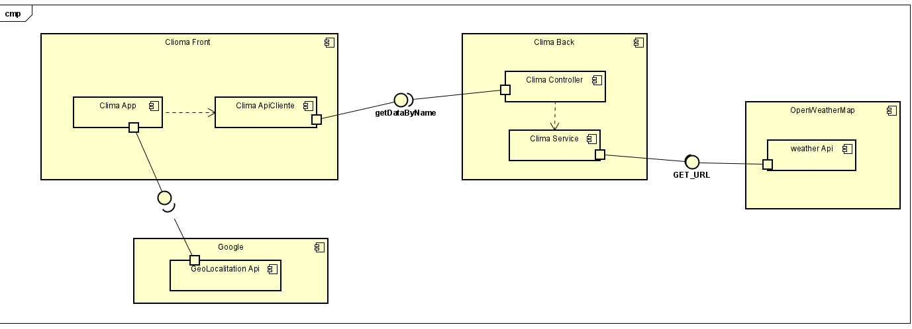
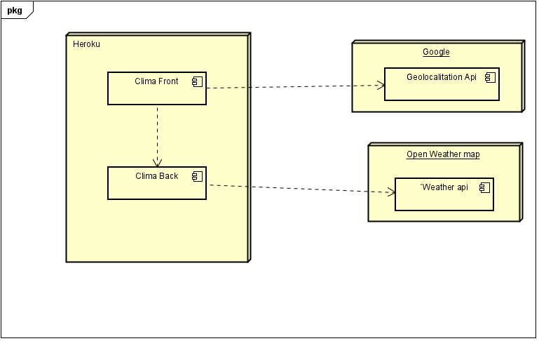
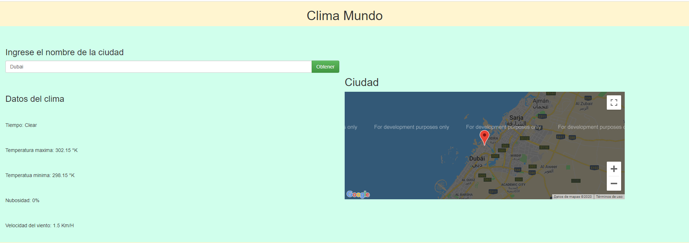

# HerreraDavidARSW-T2
### David Andres Herrera
Parcial ARSW-2020 clima

>1. La aplicacion tiene la mayoria de funcionalidades lo unico que falto es el cache
>
>2. La aplicacion se encunetra corriendo en heroku 
>
>   -  
>
>3. Los diagramas son :
>
>   
>
>   
>
>4. Muestra de la app:
>   
>   
>
>5. La app tine una intefaz para el usuario que es donde se va a mostrar todo,
>la aplicacion se conecta desde el index a el aap donde se esta haciendo la conexion
>con el apiClient este es el que va a el back donde se esta haciendo la conexion con la api
>del clima y se traen los datos, despues de tener los datos se modelan para el index
>y ahi mismo en el app se dan los datos para que el api de los mapas de google muestre la 
>ubicacion de la busqueda
>6. Para que la aplicacion busque solo basta con poner el nombre de laciudad deseada y darle click en obteber 
>Este mostrara el tiempo, temperatura maxima, minima, velocidad del viento y la nubosidad
>7. Para extender esta aplicacion web solo es crear nuevos metodos dentro del app y el back 
>para que esto que el cliente se conecte mediante una conexion http y tocaria crear las funcines para que 
>el cliente pueda ejecutar dichas funcionalidades